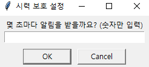
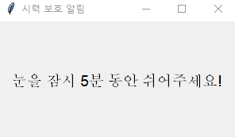

# 👁‍🗨 시력 보호 알림  

  

## 시력 보호 알림 Source code  

import tkinter as tk
from tkinter import simpledialog, messagebox

root = tk.Tk()
root.withdraw()

interval_seconds = simpledialog.askstring("시력 보호 설정", "몇 초마다 알림을 받을까요? (숫자만 입력)")

try:
    interval_seconds = int(interval_seconds)
    if interval_seconds <= 0:
        raise ValueError

    interval_ms = interval_seconds * 1000

except:
    messagebox.showerror("오류", "올바른 숫자를 입력해주세요!")
    root.destroy()
    exit()

def show_reminder():
    popup = tk.Toplevel()
    popup.title("시력 보호 알림")
    
    popup.geometry("300x150")
    
    screen_width = popup.winfo_screenwidth()
    screen_height = popup.winfo_screenheight()

    popup_width = 300
    popup_height = 150
    
    x = (screen_width - popup_width) // 2
    y = (screen_height - popup_height) // 2
    
    popup.geometry(f"300x150+{x}+{y}")

    label = tk.Label(popup, text="눈을 잠시 5분 동안 쉬어주세요!", font=("Arial", 14))
    label.pack(expand=True)

    popup.after(5000, popup.destroy)
    root.after(interval_ms, show_reminder)

root.after(interval_ms, show_reminder)

root.mainloop()
